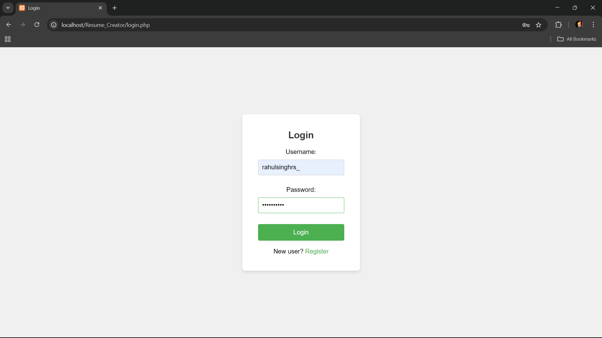
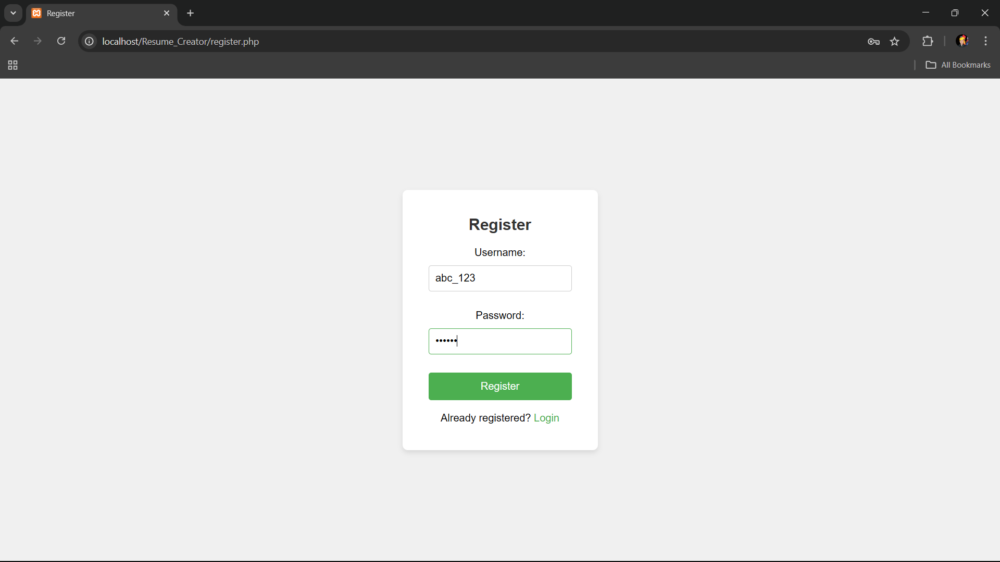
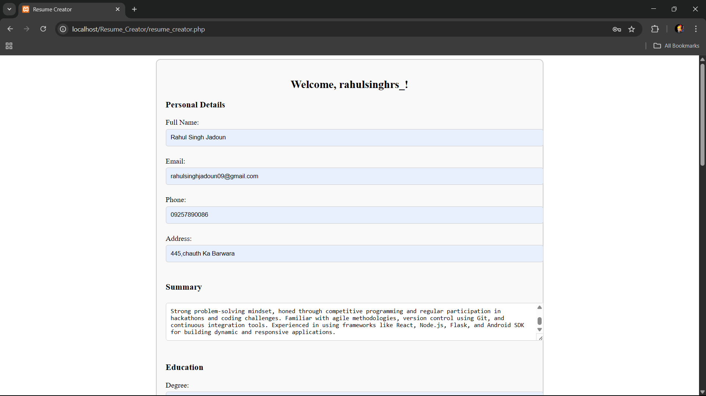
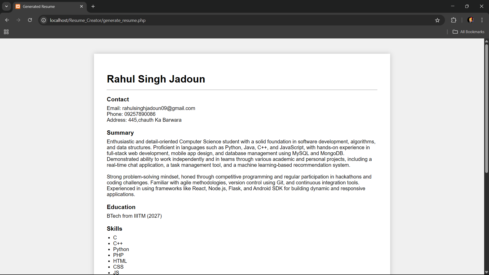
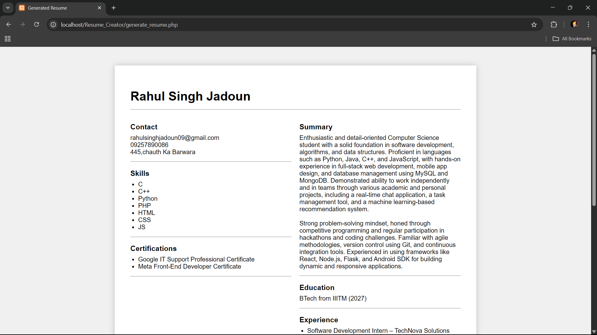

# 📄 Resume Creator - PHP

A simple PHP-based Resume Creator application with user authentication and dynamic resume generation features.

## 🚀 Features

- 🔐 **User Authentication**
  - Register new users (username and password)
  - Login functionality using session management
  - Secure user data stored in MySQL `resume` database (`user` table)

- 📝 **Resume Creation**
  - Accessible after login
  - Multiple form fields to gather user details
  - Option to generate:
    - **One Page Resume**
    - **Two Column Resume**
  - Resume is dynamically generated based on selected layout

- 💾 **Database Integration**
  - MySQL database: `resume`
  - Table: `user` with fields: `id`, `username`, `password`
  - Data handling using **POST method**
  - Session-based access control
 
## ⚙️ Tech Stack

- **Frontend**: HTML, CSS (basic styling)
- **Backend**: PHP
- **Database**: MySQL
- **Sessions**: Used for user login/logout
- **Form Handling**: POST method

## 📦 Database Setup

1. Create a database named `resume`
2. Create a `user` table:
```sql
CREATE TABLE user (
  id INT AUTO_INCREMENT PRIMARY KEY,
  username VARCHAR(100) NOT NULL,
  password VARCHAR(100) NOT NULL
);
```
## 📸 Screenshots

### 🔐 Login Page


### 🧾 Register Page


### 📝 Resume Form


### 🖨️ One Page Resume


### 📰 Two Column Resume

